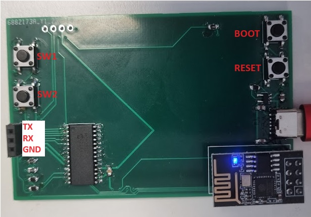

# BLINK BOARD

## Basic Info

## Libraries

Create a folder called libraries

Extract the following libraries:

* https://github.com/Basirk/kicad-ESP8266
* https://github.com/pforrmi/KiCad-SSD1306-128x64
